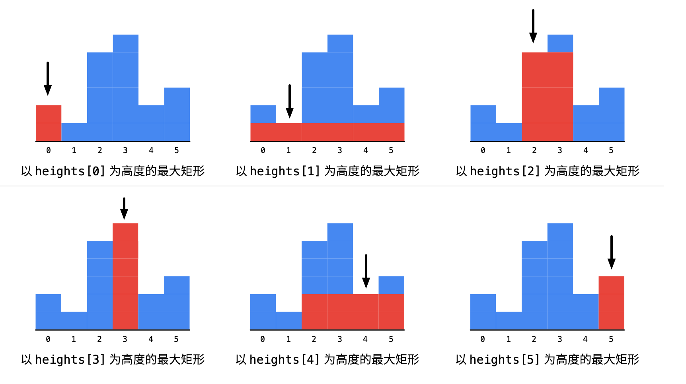

# 84. 柱状图中最大的矩形

## 题目

[题目链接](https://leetcode.cn/problems/largest-rectangle-in-histogram/)

给定 *n* 个非负整数，用来表示柱状图中各个柱子的高度。每个柱子彼此相邻，且宽度为 1 。

求在该柱状图中，能够勾勒出来的矩形的最大面积。

**示例 1:**


```
输入：heights = [2,1,5,6,2,3]
输出：10
解释：最大的矩形为图中红色区域，面积为 10
```

**示例 2：**


```
输入： heights = [2,4]
输出： 4
```

**提示：**

- `1 <= heights.length <=105`
- `0 <= heights[i] <= 104`

## 解法

依次遍历柱形的高度，对于每一个高度分别向两边扩散，求出以当前高度为矩形的最大宽度多少。



### 1 暴力破解

以每个柱子为中心向两边遍历直到找到比自己矮的柱子停止。

### 2 单调栈

核心逻辑就是找到每一根柱子两边比自己矮的柱子。

而单调递增栈则正好满足这个条件。栈顶元素当做目标柱子，那么栈顶的第二个元素就是左边比自己矮的第一根柱子，而待入栈的元素就是右边比自己矮的第一根柱子。所以利用**栈顶和栈顶的下一个元素以及要入栈的元素，这三个元素正好就能确定以当前栈顶元素为高度标准的最大矩形**。

```java
// 遍历数组
for (int i = 0; i < nums. length; i++) {
    // 栈不为空 && 栈顶元素小于当前元素
    while (!stack.isEmpty() && stack.peek() < nums[i]) {
        // 栈顶元素出栈
        stack.pop();
    }
    // 当前数据入栈
    stack.push(nums[i]);
}
```


```java
class Solution {
    public int largestRectangleArea(int[] heights) {
        // 因为要寻找向左和向右扩散的右边界，即左右两边比自己矮的柱子，所以使用单调递减栈
        Stack<Integer> stack = new Stack<>();
        int maxArea = 0;
        int width;
        int curArea;
        for (int i = 0; i < heights.length; i++) {
            // 栈不为空 && 栈顶元素小于当前元素
            while (!stack.isEmpty() && heights[stack.peek()] > heights[i]) {
                // 栈顶元素出栈
                int curIndex = stack.pop();
                // 以当前元素为高度向左扩散的边界为此时栈顶的元素，右边界为此时待入栈的元素
                width = i - (stack.isEmpty() ? -1 : stack.peek()) - 1;
                curArea = width * heights[curIndex];
                maxArea = Math.max(maxArea, curArea);
            }
            // 当前数据入栈
            stack.push(i);
        }

        // 此时还在栈中的元素的右边界全部为此时栈顶元素或数组的右边界
        int right = stack.isEmpty() ? -1 : stack.peek();
        while (!stack.isEmpty()) {
            // 栈顶元素出栈
            int curIndex = stack.pop();
            // 以当前元素为高度向左扩散的边界为此时栈顶的元素
            width = right - (stack.isEmpty() ? -1 : stack.peek());
            curArea = width * heights[curIndex];
            maxArea = Math.max(maxArea, curArea);
        }
        return maxArea;
    }
}
```

