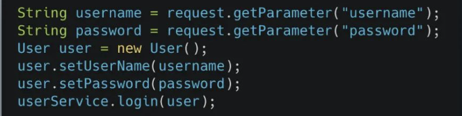
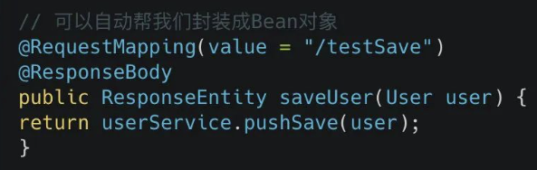
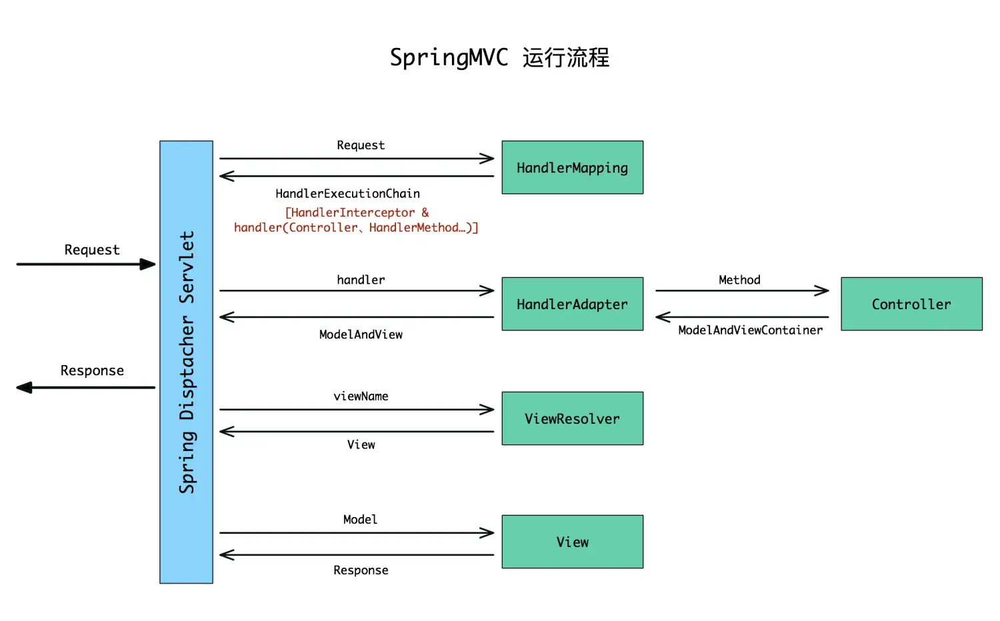
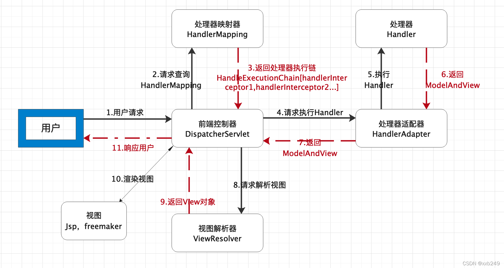

> 好文推荐：
>
> https://mp.weixin.qq.com/s/0tWgaYxavixiDCppvOfd-w
>
> https://mp.weixin.qq.com/s/BO_CPQ0x-kBMIYBOviG3Xg
>
> https://www.jianshu.com/p/f04816ee2495
>
> https://www.jianshu.com/p/23ad68d8b421
>
> https://blog.csdn.net/xxb249/article/details/120731022
>
> https://blog.csdn.net/xxb249/article/details/122224795

SpringMVC 其实就是对 Servlet 的封装，屏蔽掉 Servlet 很多的细节。比如写 Servlet 的时候，要获取参数需要不断的 getParameter，在SpringMVC 方法定义对应的 JavaBean，只要属性名与参数名一致，SpringMVC 就可以帮我们实现「将参数封装到 JavaBean」上了。又比如，以前使用 Servlet「上传文件」，需要处理各种细节，写一大堆处理的逻辑（还得导入对应的jar）。在 SpringMVC 的方法上定义出 MultipartFile 接口，又可以屏蔽掉上传文件的细节了。

**Servlet：**

**SpringMVC:**

## SpringMVC 请求处理的流程

1. 用户发送请求至**前端控制器** DispatcherServlet。

2. DispatcherServlet 收到请求调用**处理器映射器** HandlerMapping。

3. 处理器映射器根据请求 url 找到具体的处理器，生成处理器执行链 HandlerExecutionChain (包括处理器对象和处理器拦截器)一并返回给 DispatcherServlet。 

4. DispatcherServlet 根据处理器 Handler 获取**处理器适配器** HandlerAdapter 执行 HandlerAdapter 处理一系列的操作，如：参数封装，数据格式转换，数据验证等操作 

5. 执行处理器 Handler (Controller，也叫页面控制器)。 

6. Handler 执行完成返回 ModelAndView。

7. HandlerAdapter 将 Handler 执行结果 ModelAndView 返回到 DispatcherServlet。

8. DispatcherServlet 将 ModelAndView 传给 ViewReslover **视图解析器**。
9. ViewReslover 解析后返回具体 View。

10. DispatcherServlet 对 View 进行渲染视图（即将模型数据model填充至视图中）。 

11. DispatcherServlet 响应用户。

